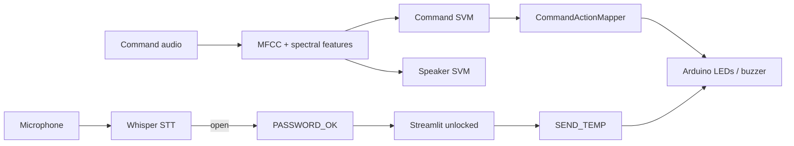

# Project 2 — Smart Home Voice Control (IEEE AI Team, Level 1)

Voice-controlled smart home: **Whisper STT password gate** → **speaker identification** → **command classification** → **Arduino actuation** + **temperature readout**, with a Streamlit GUI.

Canonical team repo: https://github.com/abdlrhmanv/smart-home-voice-control

---

## Features (spec coverage)

| Feature | Status |
|---------|--------|
| Voice password via STT (`open`) | Implemented (phrase + enrolled speaker) |
| Red LED / Arduino unlock on success | Implemented (`PASSWORD_OK`) |
| Wrong password feedback | Implemented (`PASSWORD_FAIL`) |
| Speaker identification (SVM) | Implemented (+ avatar on Voice page) |
| Command classification: light/music on/off | Implemented |
| Laptop music playback on `music on` | Implemented (looping synth + green LED) |
| Streamlit GUI | Implemented |
| Arduino serial control | Implemented |
| Temperature display | Implemented (Devices page) |
| Macro F1 ≥ 0.85 on test set | Met (~0.98 random split; LOSO still weak) |

---

## Architecture

```
Project2/
├── app.py / pages/          # Streamlit UI (thin)
├── core/                    # Streamlit-free use-cases + ports
│   ├── actions.py           # canonical command → Arduino catalog
│   ├── home.py              # unlock / devices / temperature
│   ├── password.py / voice.py / settings.py
│   ├── container.py         # composition root
│   └── memory_store.py      # test session store
├── adapters/                # Streamlit session, music, ML, mic
├── services/                # thin façades (stable page imports)
├── ai/predict.py            # ML pipeline cache façade
├── api/serial_service.py    # SerialBridge (injectable)
├── audio/recorder.py        # mic capture
├── arduino/arduino.ino      # firmware
└── ml/                      # Clean Architecture ML package
    ├── src/{domain,ports,application,infrastructure}
    ├── train_*.py / eval_*.py
    ├── data/dataset/<speaker>/<command>/*.wav
    └── models/{speaker,command}.pkl
```

**Dependency rule:** `pages` → `services` façades → `core` use-cases → ports; `adapters` + `api` implement ports. ML `create_default()` is the ML composition root; `core.container` is the app composition root.



---

## Hardware

| Component | Pin | Role |
|-----------|-----|------|
| Red LED | D11 | Password unlock indicator |
| Green LED | D12 | Music indicator |
| White LED | D10 | Light indicator (optional third LED) |
| Buzzer | D13 | Password / music feedback |
| TMP36 | A0 | Temperature |

**Serial protocol** (9600 baud, `\n`-terminated):

`PASSWORD_OK`, `PASSWORD_FAIL`, `LIGHT_ON`, `LIGHT_OFF`, `MUSIC_ON`, `MUSIC_OFF`, `SEND_TEMP`

Device commands are ignored until `PASSWORD_OK` sets the firmware unlock flag.

Set the port:

```bash
export ARDUINO_PORT=/dev/ttyUSB0   # Linux
# export ARDUINO_PORT=COM11        # Windows
```

---

## Installation

```bash
cd Project2
python -m venv .venv
source .venv/bin/activate          # Windows: .venv\Scripts\activate
pip install -r requirements.txt
```

Flash `arduino/arduino.ino` with the Arduino IDE, then connect USB.

---

## Run the Streamlit app

```bash
cd Project2
export ARDUINO_PORT=/dev/ttyUSB0   # optional but recommended
streamlit run app.py
```

**User flow**

1. **Password** page → say `open`
2. **Voice Control** → say `light on` / `light off` / `music on` / `music off`
3. **Devices** → manual toggles + **Read temperature**
4. **Activity Log** / **Settings** as needed

---

## Dataset

Expected layout:

```
ml/data/dataset/
├── ahmed/{light_on,light_off,music_on,music_off}/*.wav
├── abdullah/...
└── Abdlrhman/...
```

Target: **≥25 clips per command per speaker** (100 / person). Current inventory: ahmed 100, Abdlrhman 100, abdullah 80.

Record more data:

```bash
cd Project2/ml
python recorder_app.py
# edit ml/recorder/config.py SPEAKER_NAME before each person
```

---

## Training

```bash
cd Project2/ml
python inventory.py
python validate_dataset.py
python scaffold_conditions.py    # optional multi-condition folders
python train_speaker.py --tune
python train_command.py --tune --augment
python train_command.py --group-holdout   # harder speaker-disjoint holdout
python eval_loso.py              # leave-one-speaker-out (primary cross-speaker claim)
python eval_nested_cv.py --task command --no-tune
python make_fixtures.py          # synthetic WAVs for offline e2e
python report_calibration.py --task command   # fresh train→test (no artifact leak)
python filter_quiet_clips.py     # dry-run; add --move to quarantine
```

Streamlit Password / Voice pages also accept **WAV uploads** (no mic) for demos and Playwright.

- Features: MFCC(40) + chroma + spectral contrast + ZCR + RMS (mean+std → 122-D)
- Command extras: MFCC Δ/ΔΔ → 282-D + utterance CMVN
- Model: `StandardScaler` + RBF `SVC` + **CalibratedClassifierCV** (disable with `--no-calibrate`)
- Optional train-only waveform noise/gain: `--augment`
- Split: stratified 80/20, seed 42; optional 5-fold `GridSearchCV` on **train only** (`f1_macro`)
- Nested CV / calibration report: `eval_nested_cv.py`
- Inference reject: command conf &lt; 0.55 or speaker conf &lt; 0.45 → `unknown` (no Arduino action)
- Command STT override: Whisper phrase match (`light on` / `lighton`, …) overrides the command SVM when clear (speaker still from SVM)
- Password: Whisper phrase match **and** enrolled-speaker check (`require_known_speaker`)
- Spec gate: macro F1 ≥ **0.85** on held-out test

### Environment

Copy `.env.example` and export vars before `streamlit run`:

```bash
export WHISPER_SIZE=tiny          # faster/lighter password STT
export ARDUINO_PORT=/dev/ttyUSB0
export REQUIRE_KNOWN_SPEAKER=1
export ALLOW_OFFLINE_CONTROL=1    # unlock UI even if Arduino is unplugged
```

Speaker photos (optional): put PNGs in `assets/speakers/<speaker>.png` matching dataset folder names.

```bash
python eval_loso.py          # with CMVN (default)
python eval_loso.py --no-cmvn
```

### Hardware note (2-LED boards)

Team schematic often has **red (D11) + green (D12) + buzzer (D13)** only. Firmware still defines **white light LED on D10** — wire a third LED there for full light feedback, or accept that `LIGHT_*` has no visual on a 2-LED breadboard.

### Public ML API

```python
from src.application import SmartHomePipeline

pipe = SmartHomePipeline.create_default()
gate = pipe.verify_password("password.wav")
result = pipe.predict_voice_command("command.wav")
```

---

## Testing

```bash
cd Project2
pytest --cov=ml/src --cov=api --cov=services --cov=ai --cov-report=term-missing

# Optional Streamlit UI smoke (needs playwright + chromium)
pip install -r requirements-dev.txt
playwright install chromium
RUN_UI_E2E=1 pytest tests/test_ui_smoke.py -q
```

Covers labels, features, password normalization, action mapping, serial parsing, trainer validation, service e2e, and inference on real models/dataset samples.

---

## Deployment checklist (course submission)

- [ ] Full source on GitHub
- [ ] Arduino sketch uploaded
- [ ] Circuit photo uploaded
- [ ] Demo video (~2 min, English) showing multi-speaker control
- [ ] Markdown report / README

---

## Known limitations

- Password requires phrase **and** enrolled speaker; phrase alone is not enough, but STT can still mis-hear.
- Low-confidence predictions become `unknown` and are not sent to Arduino.
- **Leave-one-speaker-out** command F1 is still near chance (~0.11) even with CMVN + MFCC deltas — same-speaker holdout F1 (~0.98) is what the course demo exercises. Collect more multi-condition / multi-mic data before claiming cross-speaker robustness.
- White LED pin (D10) may be unwired if the breadboard only has red + green LEDs.
- `MUSIC_ON` plays a synthesized loop on the laptop speakers; replace with a real track in `services/music_player.py` if desired.
- Serial autodetection only matches Arduino-like ports; set `ARDUINO_PORT` explicitly when needed.
