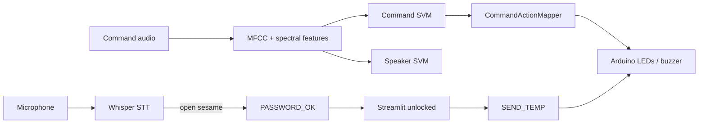

# Project 2 — Smart Home Voice Control (IEEE AI Team, Level 1)

Voice-controlled smart home: **Whisper STT password gate** → **speaker identification** → **command classification** → **Arduino actuation** + **temperature readout**, with a Streamlit GUI.

Canonical team repo: https://github.com/abdlrhmanv/smart-home-voice-control

---

## Features (spec coverage)

| Feature | Status |
|---------|--------|
| Voice password via STT (`open sesame`) | Implemented |
| Red LED / Arduino unlock on success | Implemented (`PASSWORD_OK`) |
| Wrong password feedback | Implemented (`PASSWORD_FAIL`) |
| Speaker identification (SVM) | Implemented |
| Command classification: light/music on/off | Implemented |
| Streamlit GUI | Implemented |
| Arduino serial control | Implemented |
| Temperature display | Implemented (Devices page) |
| Macro F1 ≥ 0.85 on test set | Met (~0.98 for both models) |

---

## Architecture

```
Project2/
├── app.py / pages/          # Streamlit multipage UI
├── services/                # password, voice, device use-cases
├── ai/predict.py            # façade → ml SmartHomePipeline
├── api/serial_service.py    # Arduino TX/RX
├── audio/recorder.py        # mic capture
├── arduino/arduino.ino      # firmware
└── ml/
    ├── src/
    │   ├── domain/          # labels, dataclasses, paths
    │   ├── ports/           # Classifier, FeatureExtractor, …
    │   ├── application/     # Pipeline, Trainer, Evaluator
    │   ├── infrastructure/  # librosa, sklearn, whisper, joblib
    │   ├── actions/         # command → Arduino mapping
    │   └── config.py
    ├── recorder/            # Tkinter dataset recorder (isolated)
    ├── train_speaker.py
    ├── train_command.py
    ├── data/dataset/<speaker>/<command>/*.wav
    └── models/{speaker,command}.pkl
```

**Dependency rule:** application code depends on ports; `create_default()` is the composition root that wires infrastructure.



---

## Hardware

| Component | Pin | Role |
|-----------|-----|------|
| Red LED | D11 | Password unlock indicator |
| Green LED | D12 | Music indicator |
| White LED | D10 | Light indicator (optional third LED) |
| Buzzer | D13 | Password / music feedback |
| TMP36 | A0 | Temperature |

**Serial protocol** (9600 baud, `\n`-terminated):

`PASSWORD_OK`, `PASSWORD_FAIL`, `LIGHT_ON`, `LIGHT_OFF`, `MUSIC_ON`, `MUSIC_OFF`, `SEND_TEMP`

Device commands are ignored until `PASSWORD_OK` sets the firmware unlock flag.

Set the port:

```bash
export ARDUINO_PORT=/dev/ttyUSB0   # Linux
# export ARDUINO_PORT=COM11        # Windows
```

---

## Installation

```bash
cd Project2
python -m venv .venv
source .venv/bin/activate          # Windows: .venv\Scripts\activate
pip install -r requirements.txt
```

Flash `arduino/arduino.ino` with the Arduino IDE, then connect USB.

---

## Run the Streamlit app

```bash
cd Project2
export ARDUINO_PORT=/dev/ttyUSB0   # optional but recommended
streamlit run app.py
```

**User flow**

1. **Password** page → say `open sesame`
2. **Voice Control** → say `light on` / `light off` / `music on` / `music off`
3. **Devices** → manual toggles + **Read temperature**
4. **Activity Log** / **Settings** as needed

---

## Dataset

Expected layout:

```
ml/data/dataset/
├── ahmed/{light_on,light_off,music_on,music_off}/*.wav
├── abdullah/...
└── Abdlrhman/...
```

Target: **≥25 clips per command per speaker** (100 / person). Current inventory: ahmed 100, Abdlrhman 100, abdullah 80.

Record more data:

```bash
cd Project2/ml
python recorder_app.py
# edit ml/recorder/config.py SPEAKER_NAME before each person
```

---

## Training

```bash
cd Project2/ml
python inventory.py
python train_speaker.py --tune
python train_command.py --tune
python eval_loso.py          # leave-one-speaker-out (stricter generalization)
```

- Features: MFCC(40) + chroma + spectral contrast + ZCR + RMS (mean+std → 122-D)
- Model: `StandardScaler` + RBF `SVC` (joblib → `models/*.pkl`)
- Split: stratified 80/20, seed 42; optional 5-fold `GridSearchCV` on **train only** (`f1_macro`)
- Inference reject: command conf &lt; 0.55 or speaker conf &lt; 0.45 → `unknown` (no Arduino action)
- Spec gate: macro F1 ≥ **0.85** on held-out test

### Hardware note (2-LED boards)

Team schematic often has **red (D11) + green (D12) + buzzer (D13)** only. Firmware still defines **white light LED on D10** — wire a third LED there for full light feedback, or accept that `LIGHT_*` has no visual on a 2-LED breadboard.

### Public ML API

```python
from src.application import SmartHomePipeline

pipe = SmartHomePipeline.create_default()
gate = pipe.verify_password("password.wav")
result = pipe.predict_voice_command("command.wav")
```

---

## Testing

```bash
cd Project2
pytest --cov=ml/src --cov=api --cov=services --cov=ai --cov-report=term-missing
```

Covers labels, features, password normalization, action mapping, serial parsing, trainer validation, and inference on real models/dataset samples.

---

## Deployment checklist (course submission)

- [ ] Full source on GitHub
- [ ] Arduino sketch uploaded
- [ ] Circuit photo uploaded
- [ ] Demo video (~2 min, English) showing multi-speaker control
- [ ] Markdown report / README

---

## Known limitations

- Password is a **shared spoken phrase** (STT exact match), not speaker-verified login.
- Low-confidence predictions become `unknown` and are not sent to Arduino.
- **Leave-one-speaker-out** command F1 is currently ~0.11 (near chance) — the random 80/20 F1 (~0.98) is optimistic because the same speakers appear in train and test. Collect more diverse data or train speaker-independent features before claiming cross-speaker robustness.
- White LED pin (D10) may be unwired if the breadboard only has red + green LEDs.
